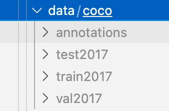

# Fabric Defect Detection
[TOC]
This is the lab work of Computer Vision and Applications. The work is based on [MMDetections](https://github.com/open-mmlab/mmdetection)
## Installation of MMdetection
Version v2.25.0 of MMDetection has a bug，therefore in this work, I use v2.24.1. Just clone the repository and install it following the [docs](https://mmdetection.readthedocs.io/en/latest/get_started.html#installation).

## Preparation

### Source code
In this work, there are 20 classes of fabric defects. Therefore, we need to modify `num_classes=80` to `num_classes=20` in the source code, and change the classes `coco_classes` to this:


```python
def coco_classes():
    return [
        '1','2','3','4','5','6','7','8','9','10',
        '11','12','13','14','15','16','17','18','19','20'
    ]
```

### Organize the dataset
Organize the dataset as follows, `annotations` stores `JSON` annotations of train and validation set. `test2017`, `train2017`, `val2017` store test set, train set, and validation set respectively.


## Training

For example, to train a `yolox_tiny_8x8_300e` model, run the following command. To train another model, just modify the second argument.

```sh
python tools/train.py configs/yolox yolox_tiny_8x8_300e_coco.py
```

After training there will be a folder named after the model in the path `mmdetection/work_dirs`. In the folder there are `log` and `JSON` recording training information like training loss after each epoch, as well as `.pth` files, neural networks after each epochs.

### 绘制 loss 曲线

MMDetection can plot loss curve based on `JSON` after training by running the following command.
```bash
python tools/analysis_tools/analyze_logs.py plot_curve \
       work_dirs/yolox_tiny_8x8_300e_coco/20220609_150435.log.json --keys loss --out ./plot_result/4.png

```

This is the loss curve of `faster_rcnn_r50_fpn_1x_coco`


## Test

The file `testToJson.py` tests the model as well as generating `JSON` file with the following format

```json
[
    { "name": "1560926838524.jpg",
      "category": 1,
      "bbox": [339.66,15.65,356.00,61.33],
      "score": 0.0087397042 }, 
    { "name": "1560926838524.jpg", 
      "category": 2, 
      "bbox": [52.86,174.86,104.91,633.56], 
      "score": 0.5624360123 }, 
    { "name": "257092683862.jpg", 
      "category": 2, 
      "bbox": [339.61,7.21,355.94,48.61],
      "score": 0.0135210491 } 
]
```
To test the model and see he performance, run
```bash
python tools/test.py \
       configs/faster_rcnn/faster_rcnn_r50_fpn_1x_coco.py \
       work_dirs/faster_rcnn_r50_fpn_1x_coco/epoch_24.pth --eval bbox --show
```

## References
https://mmdetection.readthedocs.io/en/stable/index.html

https://blog.csdn.net/qq_33897832/article/details/103995636

https://blog.csdn.net/weixin_45734379/article/details/112725000

https://cloud.tencent.com/developer/article/1771899

Loss Visualization https://blog.csdn.net/kellyroslyn/article/details/110086658